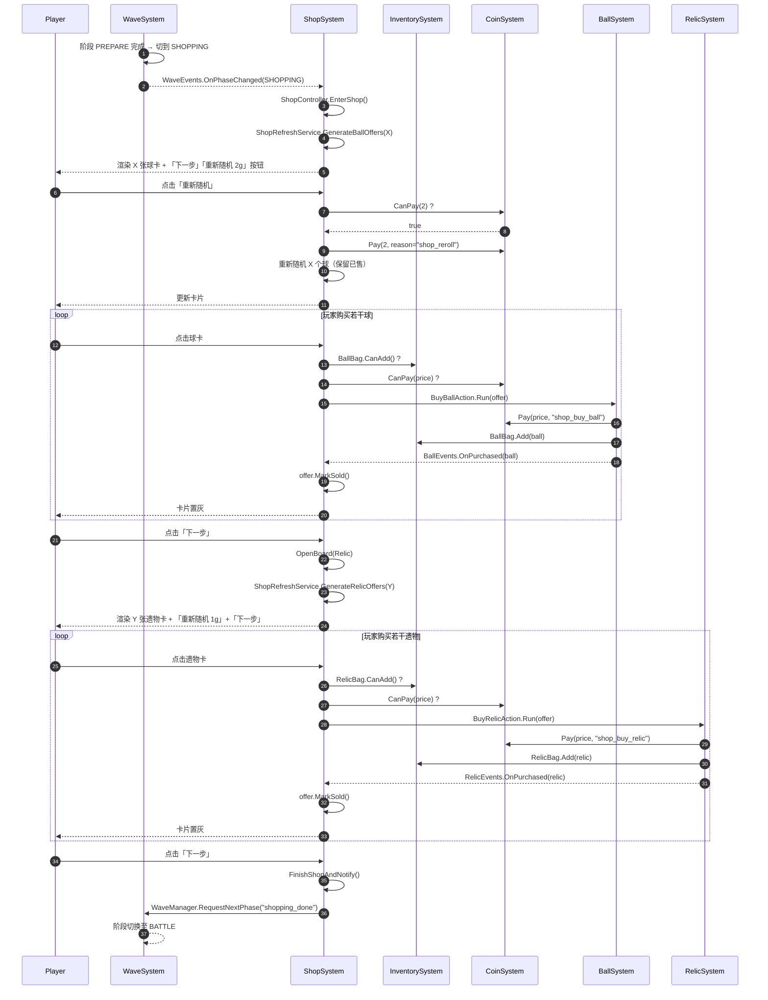
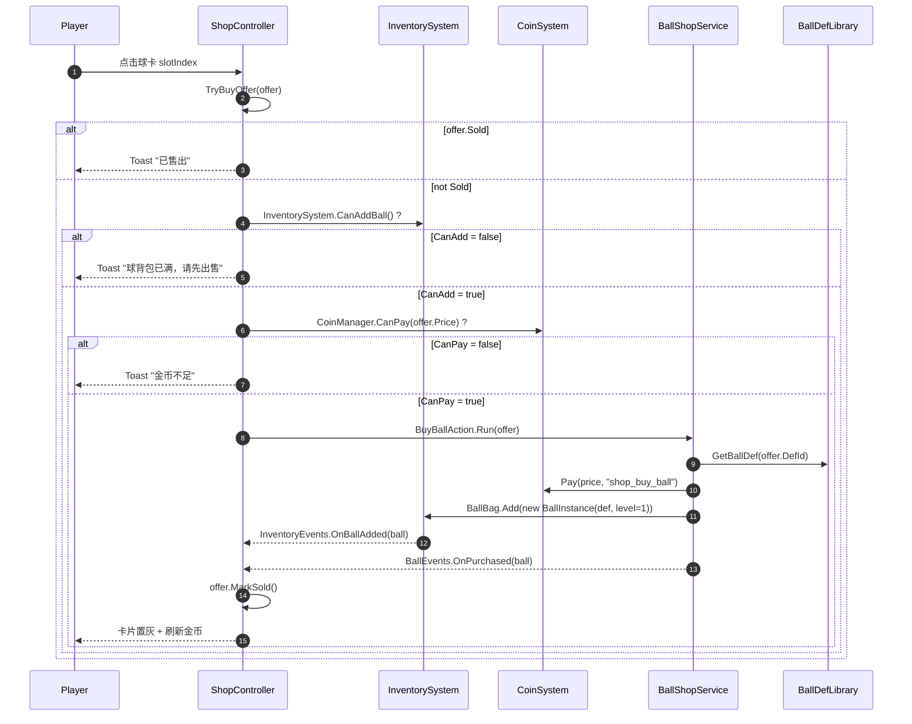
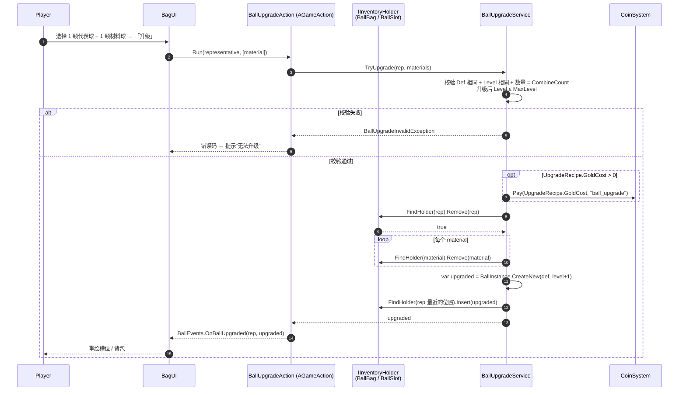
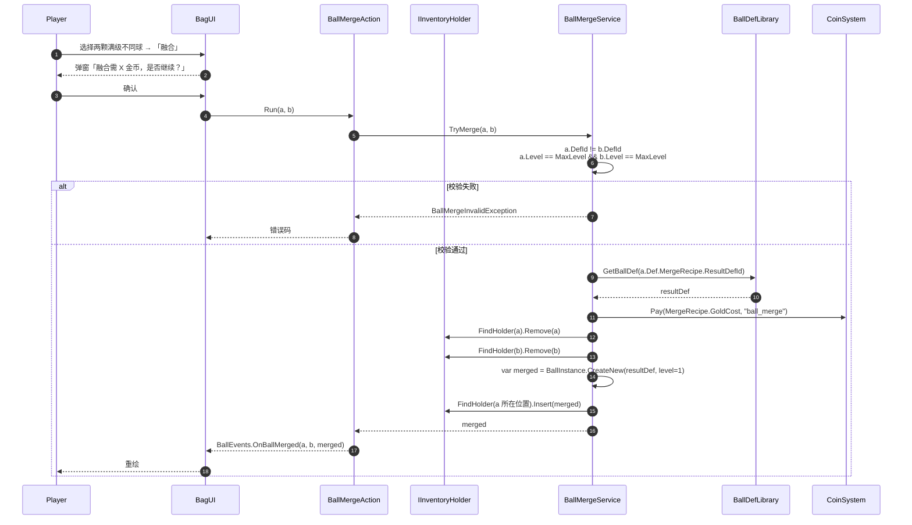
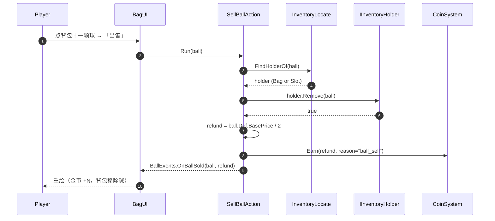
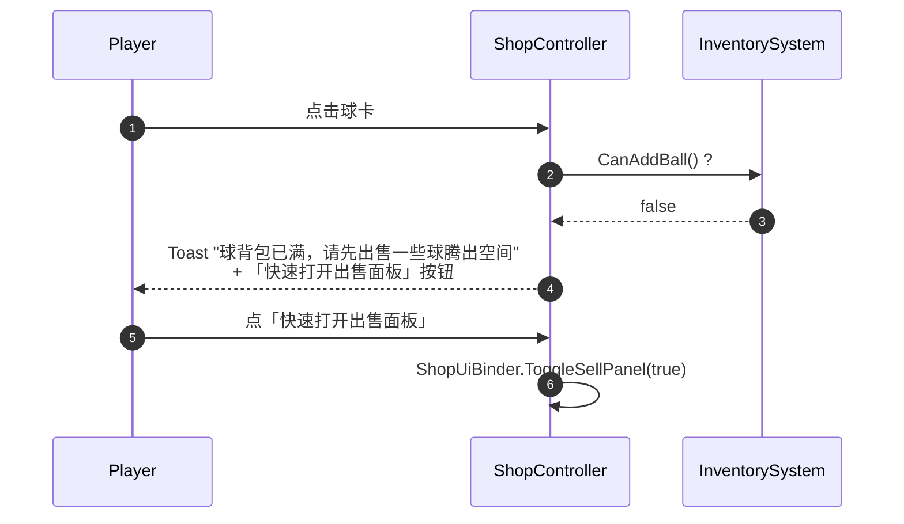
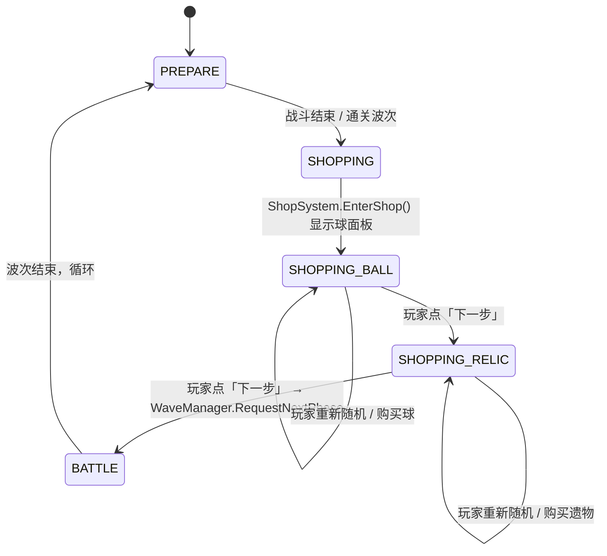

# MyFramework：球管理 · 商店 · 背包 三大系统与波次协作时序图

> 子文档，承接总览 [球管理·商店·背包 系统拆分与协作设计](MyFramework:球管理·商店·背包%20系统拆分与协作设计.md)。
>
> 本文用统一的 mermaid 时序图描述三个核心场景，确保任何后续开发对照时一目了然。

---

## 0. 系统与角色约定

| 角色 | 类型 | 出现于 |
| --- | --- | --- |
| `Player` | 玩家 | 全部场景 |
| `WaveSystem` | `WaveManager`（已在 `AWaves/`） | 阶段切换 |
| `ShopSystem` | `ShopController`（新 `AShop/`） | 商店流程 |
| `CoinSystem` | `CoinManager`（已在 `ACoin/`） | 金币支付 |
| `InventorySystem` | `InventorySystem / BallBag / RelicBag`（新 `AInventory/`） | 背包容量 |
| `BallSystem` | `BallManagementSystem`（新 `ABall/`） | 球升级 / 融合 / 购买 |
| `RelicSystem` | 已有 `ARelics/` | 遗物使用 / 出售 |
| `BallSlot` | `BallSlotGroup`（新 `ABall/Slot/`） | 发射槽位 |
| `BallDefLib` | `BallDefLibrary`（新 `ABall/Core/`） | 球 def 数据 |

```text
所有跨系统调用都是"问 + 通知"，没有"直接动 private 数据"。
所有写操作（Add/Remove/Pay/Earn）都不在 SS / WaveSystem 里出现，
它们的调用者必须是 Command 或者 AGmaeAction。
```

---

## 1. 总时序：战备阶段 → 球商店 → 遗物商店 → 下一波



---

## 2. 子时序：玩家购买球（一次点击放大版）



### 关键不变量

- **任何扣金币都走 `CoinManager.Pay(amount, reason)`**，reason 至少包括："shop_reroll"、"shop_buy_ball"、"shop_buy_relic"、"ball_sell"、"relic_sell"、"ball_merge"。
- **任何加背包都走 `InventorySystem.BallBag.Add(item)` 或 `RelicBag.Add(item)`**。
- **任何切阶段都走 `WaveManager.RequestNextPhase(reason)`**，由 WaveManager 决定下一步。

---

## 3. 子时序：玩家升级（X=2 颗同种同等级 → 1 颗 Level+1）



> **升级可在槽位上**也**可在背包**上。`IInventoryHolder` 抽象负责"找到这个球，移除它"。升级产物放入最后一个被移除的位置，从而不偏离玩家视线。

---

## 4. 子时序：玩家融合（两颗满级不同球 → 一颗 Lv1 融合球）



---

## 5. 子时序：玩家从背包出售一颗球（半价回收）



> 出售若发生在**槽位**上：先 `slot.Clear()`，再 `CoinManager.Earn`，再发事件。槽位为空后由 UI 自动显示"空"。

---

## 6. 子时序：背包满时拒绝购买



---

## 7. 状态机总览：WaveSystem ↔ ShopSystem



> 进入 `SHOPPING_BALL` 与 `SHOPPING_RELIC` 时，`ShopSystem` 处于子状态机 `ShowBallBoard` / `ShowRelicBoard`（见 ShopSystem 子文档）。

---

## 8. 跨系统调用次数限制（性能与 GC）

跨系统调用都走事件 / 命令，所以很难"漏调用"。但要小心：

| 风险 | 来源 | 缓解 |
| --- | --- | --- |
| `BallEvents` 订阅者太多，每次变更都遍历 | UI 多 / Save 多 | 改为 bulk 事件 `OnBagChanged`；UI 内部自己 diff |
| 一次升级触发 5 个事件 | Add + Remove 各 N 个 | 升级路径用「先 Remove，过程静默，最后统一发 BulkChanged」模式 |
| 玩家疯狂「重新随机」 | 短时间 N 次扣金币 | `ShopUiBinder.OnClickReroll` 在执行期间禁用按钮（按钮 disabled） |
| 大背包满时 IO 慢 | 备份 / 存档 | 序列化走 `SaveSystem` 异步队列（项目已有） |
| UI 重绘时 GC | 创建 / 销毁卡片 | 卡片控件来自 `UIPrefabPool` |

---

## 9. 错误码与玩家提示约定

| 场景 | 内部异常 | 玩家 Toast / UI 提示 |
| --- | --- | --- |
| 球背包已满无法购买 | `InventoryFullException(ItemKind.Ball)` | "球背包已满，请先出售一些球腾出空间" |
| 遗物背包已满无法购买 | `InventoryFullException(ItemKind.Relic)` | "遗物背包已满，请先出售一些遗物腾出空间" |
| 金币不足 | `CoinInsufficientException` | "金币不足" |
| 升级：等级已满 | `BallUpgradeInvalidException("max_level")` | "该球已满级，无法升级" |
| 升级：不够 X 个 | `BallUpgradeInvalidException("not_enough")` | "需要 X 个同类同等级球" |
| 升级：金币不足 | 走 `CoinInsufficientException` | "金币不足" |
| 融合：同种不行 | `BallMergeInvalidException("same_kind")` | "需要两个不同种类的球" |
| 融合：未满级 | `BallMergeInvalidException("not_max_level")` | "两个球都需满级才能融合" |
| 融合：金币不足 | 走 `CoinInsufficientException` | "金币不足" |
| 重新随机：金币不足 | 走 `CoinInsufficientException` | "金币不足以重新随机" |
| 商品卡已售 | UI 状态兜住 | 卡片置灰，点击不响应 |
| 槽位扩容超限 | `InventoryExpansionLimitException` | "已达上限" |

---

## 10. 与 MyFramework 现有 Command / Event / Pool 的对接一览

| 步骤 | 走 Event? | 走 Command? | 写入（持久化）? |
| --- | --- | --- | --- |
| `WaveManager.ToPhase = SHOPPING` 通知 SS | ✅ (`WaveEvents`) | — | — |
| `ShopSystem.EnterShop()` | ✅ (`ShopEvents.OnShopOpened`) | — | — |
| `ShopController.Render(offers)` | — | — | — |
| 玩家点击「购买」触发写入 | ✅ (`BallEvents.OnPurchased`) | ✅ (`BuyBallAction`) | ✅（需要存档时） |
| 玩家点击「重新随机」 | ✅ (`ShopEvents.OnBoardRerolled`) | ✅ (`RerollShopBoardAction`) | ✅（金币数） |
| 玩家点击「下一步」 | ✅ (`ShopEvents.OnBoardOpened(Relic)`) | ✅ (`GoNextShopPhaseAction`) | — |
| 玩家点击「出售」 | ✅ (`BallEvents.OnBallSold`) | ✅ (`SellBallAction`) | ✅ |
| 玩家点「升级」 | ✅ (`BallEvents.OnBallUpgraded`) | ✅ (`BallUpgradeAction`) | ✅ |
| 玩家点「融合」 | ✅ (`BallEvents.OnBallMerged`) | ✅ (`BallMergeAction`) | ✅ |

> **写操作 → Command** 原则不变。这样所有"改变金币 / 改变背包 / 改变持有球"的动作都能进 CommandStack，用于回放、调试、回滚（撤销）。

---

## 11. 一次性 checklist：实现这套方案必须做的事

- [ ] 新建 `Assets/Scripts/HotFix/_Gameplay/ABall/`
- [ ] 新建 `Assets/Scripts/HotFix/_Gameplay/AInventory/`
- [ ] 新建 `Assets/Scripts/HotFix/_Gameplay/AShop/`
- [ ] 让 `ARelic` 实现 `IInventoryItem`
- [ ] 让 `BallInstance` 实现 `IInventoryItem`
- [ ] 让 `CoinManager.Pay / Earn` 支持可选 `reason` 参数
- [ ] 让 `WaveManager` 发 `WaveEvents.OnPhaseChanged(Phase)`
- [ ] 把 `8_ShoppingPhase.cs` 改成只委托给 `ShopSystem.Instance`
- [ ] 把 `4_PreparePhase.cs` 不动（保持原状）
- [ ] 给三个系统分别建一个 `XXXConfig` ScriptableObject
- [ ] 给三个系统分别建事件总线 `XXXEvents`
- [ ] 把"购买 / 出售 / 升级 / 融合 / reroll / next"封装成 `AGameAction`
- [ ] UI 上三套面板：球背包、遗物背包、商店面板（球 + 遗物）
- [ ] 单元测试三个系统的关键校验路径

---

## 12. 文档导航

1. [球管理·商店·背包 系统拆分与协作设计](MyFramework:球管理·商店·背包%20系统拆分与协作设计.md)
2. [BallManagementSystem 球管理系统设计](MyFramework:BallManagementSystem%20球管理系统设计.md)
3. [InventorySystem 背包系统设计](MyFramework:InventorySystem%20背包系统设计.md)
4. [ShopSystem 商店系统设计](MyFramework:ShopSystem%20商店系统设计.md)
5. 本文档（本页）
